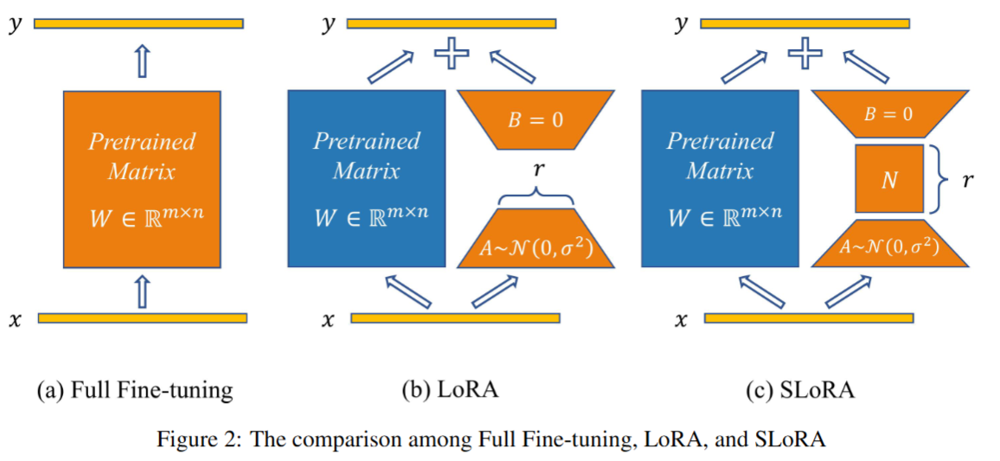
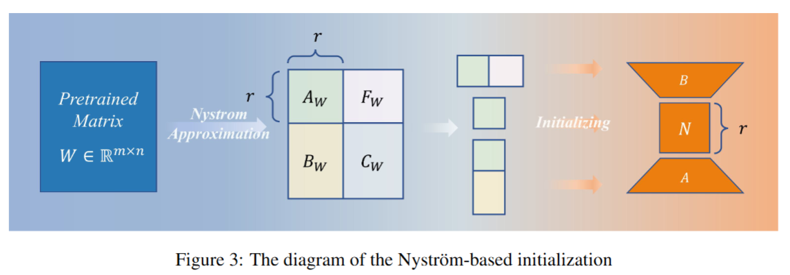
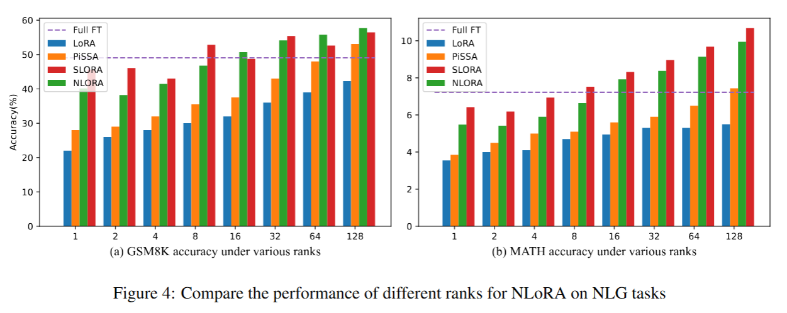
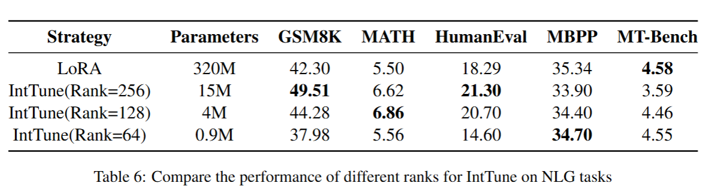

# NLoRA
NLoRA: Nyström-Initiated Low-Rank Adaptation for Large Language Models

## Introduction
Parameter-efficient fine-tuning (PEFT) is essential for adapting large language models (LLMs), with low-rank adaptation (LoRA) being the most popular approach. However, LoRA suffers from slow convergence, and some recent LoRA variants, such as PiSSA, primarily rely on Singular Value Decomposition (SVD) for initialization, leading to expensive computation. To mitigate these problems, we use the Nyström method, which follows a three-matrix manipulation.

We first introduce StructuredLoRA (SLoRA), which investigates adding a small intermediate matrix between the low-rank matrices A and B. Secondly, we propose NyströmLoRA (NLoRA), which leverages Nyström-based initialization for SLoRA to improve its effectiveness and efficiency. Finally, we propose IntermediateTune (IntTune), which explores fine-tuning exclusively on the intermediate matrix of NLoRA to further boost LLM efficiency.

We evaluate our methods on five natural language generation (NLG) tasks and eight natural language understanding (NLU) tasks. On GSM8K, SLoRA and NLoRA achieve accuracies of 56.48% and 57.70%, surpassing LoRA by 33.52% and 36.41%, with only 3.67 million additional trainable parameters. IntTune improves average NLG performance over LoRA by 7.45% while using only 1.25% of its parameters. These results demonstrate the efficiency and effectiveness of our approach in enhancing model performance with minimal parameter overhead.







## Quick Start
### 1. Install custom peft
Install NLoRA repository, install the dependency packages, and install custom peft
```
git clone https://github.com/TracyGuo2001/NLoRA.git
cd NLoRA
pip install -r requirements.txt
pip install -e peft
```
### 2. Use NLoRA in peft
Here is an example of how to load a pre-processed model and finetune it on IMDB dataset by NLoRA:
```python
from trl import SFTTrainer
from datasets import load_dataset
from transformers import AutoTokenizer, AutoModelForCausalLM
from peft import LoraConfig, TaskType, get_peft_model, PeftModel
MODEL_ID = "meta-llama/Llama-2-7b-hf"
base_model = AutoModelForCausalLM.from_pretrained(MODEL_ID,device_map="auto")
peft_config = LoraConfig(
                task_type=TaskType.CAUSAL_LM,
                target_modules=["q_proj", "o_proj", "k_proj", "v_proj", "gate_proj", "up_proj", "down_proj"],
                inference_mode=False,
                r=128,
                lora_alpha=128,
                lora_dropout=0,
                init_lora_weights='n_lora',
            )
peft_model = get_peft_model(base_model, peft_config)
peft_model.print_trainable_parameters()

tokenizer = AutoTokenizer.from_pretrained(MODEL_ID)
dataset = load_dataset("imdb", split="train[:1%]") # Only use 1% of the dataset
trainer = SFTTrainer(
    model=peft_model,
    train_dataset=dataset,
    dataset_text_field="text",
    max_seq_length=128,
    tokenizer=tokenizer,
)
trainer.train()
peft_model.save_pretrained("nlora-llama-2-7b-ft")
```
Setting `init_lora_weights` to `'s_lora'` enables the **SLoRA** model, where the intermediate matrix is Kaiming initialized by default. You can modify this initialization in the `slora_init()` function inside `peft/tuners/lora/layer.py`.
### 3. Convert NLoRA to LoRA
If you want to revert to the standard **LoRA**, simply set `init_lora_weights = True`.

## Citation
```
@article{guo2025nlora,
  title={NLoRA: Nystr$\backslash$" om-Initiated Low-Rank Adaptation for Large Language Models},
  author={Guo, Chenlu and Wu, Yuan and Chang, Yi},
  journal={arXiv preprint arXiv:2502.14482},
  year={2025}
}
```
